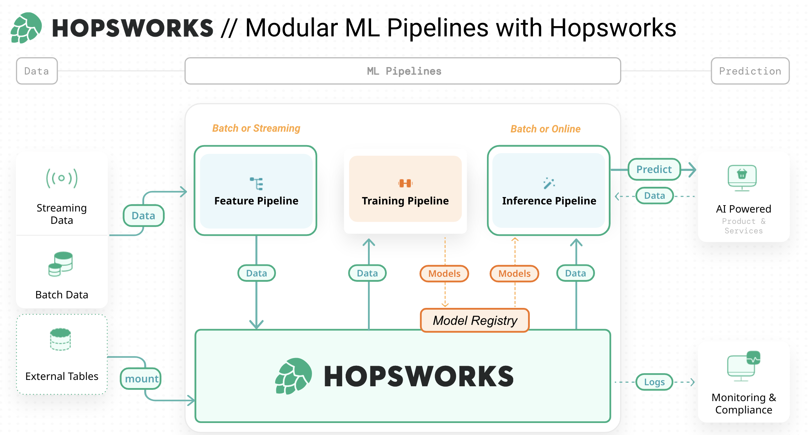
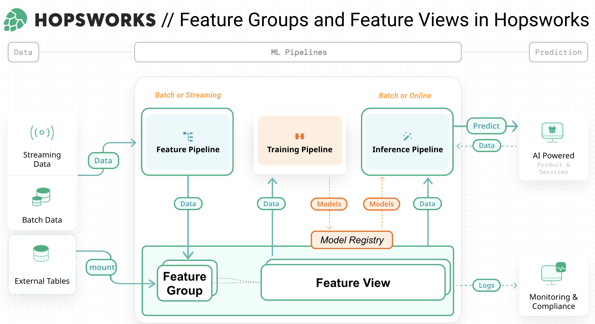
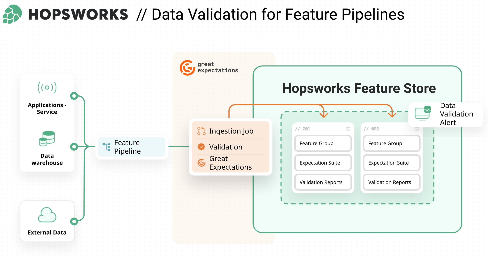
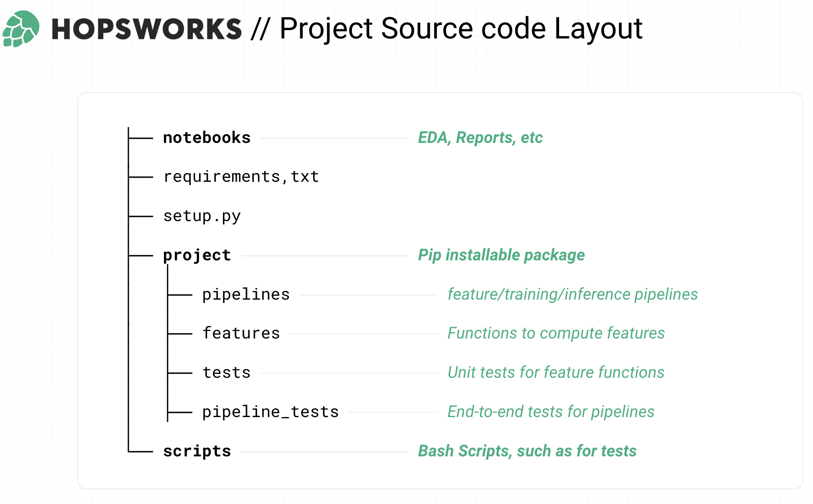

## Hopsworks MLOps Template

## Introduction
In this article, we present a new mental map for ML Systems as three independent ML pipelines: feature pipelines, 
training pipelines, and inference pipelines that share a common storage layer for the ML artifacts they produce and 
consume (features, models). In contrast to existing MLOps architectures, we provide a unified architecture that 
describes both batch ML systems and real-time ML systems. This makes it easier for developers to move to/from batch 
and real-time systems, and provides clear interfaces between the ML pipelines, enabling easier collaboration between 
the data, ML, and product teams that work together to develop and operate ML systems. 
Compared to existing MLOps architectures, the feature/training/inference pipeline architecture helps you get faster 
to a minimal working ML system that can be iteratively improved, while following best practices for automated testing, 
versioning, and monitoring.

The existing mantra is that MLOps is about automating continuous integration (CI), continuous delivery (CD), and 
continuous training (CT) for ML systems. But that is too abstract for many developers. MLOps is really about continual 
development of ML-enabled products that evolve over time. The available input data (features) changes over time, 
the target you are trying to predict changes over time. You need to make changes to the source code, and you want to 
ensure that any changes you make do not break your ML system or degrade its performance. And you want to accelerate 
the time required to make those changes and test before those changes are automatically deployed to production.


## Modular ML Pipelines with Hopsworks


- a feature pipeline that takes as input raw data that it transforms into features (and labels)
- a training pipeline that takes as input features (and labels) and outputs a trained model, and
- an inference pipeline that takes new feature data and a trained model and makes predictions.

- build a feature pipeline to continually create features from your novel data source, save those features as a 
DataFrame to Hopsworks Feature Store;
- write a training pipeline that reads training data from the Feature Store, trains your model and saves the trained 
model in the model registry,
- write a batch inference pipeline or online inference pipeline that downloads the trained model, then takes new 
feature data, either from the feature store or computes it from user requests, and makes predictions consumed by the ML-enabled 
product (often a simple UI written in Python using Streamlit or Gradio).

## Feature Groups and Feature Views in Hopsworks


A feature group can be seen as a collection of conceptually related features that are computed together at the same cadence. 
In your case, you will create a feature group for the transaction data and a feature group for the windowed aggregations on 
the transaction data. Both will have tid as primary key, which will allow you to join them together to create training data 
in a follow-on tutorial.

Feature groups provide a namespace for features, so two features are allowed to have the same name as long as they 
belong to different feature groups. For instance, in a real-life setting we would likely want to experiment with 
different window lengths. In that case, we can create feature groups with identical schema for each window length.


The Feature View is the collection of features (from feature groups) and transformation functions used to train models 
and serve precomputed features to deployed models.

The Feature View includes all of the features defined in the query object you created earlier. It can additionally 
include filters, one or more columns identified as the target(s) (or label) and the set of transformation functions and 
the features they are applied to.

## Data Validation for Feature Pipelines


Great Expectations (GE) enables organizations to ensure high quality feature data . At its core, GE provides 
Expectations which can be evaluated against DataFrames. This generates a report that can be used both as data 
documentation but also as fulfilled production requirements for data quality. Hopsworks 3.0 now supports integration 
with Great Expectations. Simply attach a suite of Expectations to your Feature Group to benefit from automatic 
validation of data on insertion. The Validation Reports are immediately displayed in the Hopsworks UI. Users can also 
add alerts to be notified in case of insertion failure due to data quality issues.

Hopsworks integrates with Great Expectations to enable validation of data which are about to be inserted into the Feature Store. This allows data validation to act both as a gatekeeper for the Feature Store but also to monitor and document the incoming data. Gatekeeping ensures that production projects can maintain high quality data, while monitoring enables the team to follow the evolution of the underlying data. The aim should be to create confidence for downstream users that the data in the Feature Store have been thoroughly validated and can be relied on for production grade applications, especially for online enable projects.


As the Feature Store simplifies and encourages the reuse of features, it makes sense to validate data before writing to any Feature Groups. Data validation is performed once per feature rather than once per use-case. Not only does it reduce the validation burden on the data engineering team but it also builds trust in the quality of the data available in the Feature Store.

Feature Groups (FG) in Hopsworks are defined by a schema (similar to a Pandas DataFrame or a table in a relational database). The schema consists of feature names and data types. One can think of these FGs as a destination table where feature pipelines regularly insert DataFrames, appending, updating, or deleting rows. Adding validation starts with defining an Expectation Suite in Great Expectations. It will hold all of the Expectations required to validate DataFrames to be inserted into the FG. It is then a matter of writing a job to perform validation manually. However this generates a lot of boilerplate and additional management such as storing and fetching the suite, running validation, storing and fetching reports, and alerts on failure.
Taking advantage of Great Expectations integration eliminates these obstacles. Simply attach your GE expectation suite to a FG, and Hopsworks python client will take care of the data validation step automatically on every insert. In addition the Feature Store centralizes everything by storing both the data, the suite and validation reports.

```python
# Create your Feature Group Metadata to start writing your Features
trans_fg = fs.get_or_create_feature_group(
    name="feature_group_transactions",
    version=1,
    description="Transaction data",
    primary_key=['cc_num'],
    event_time=['datetime']
)

# Insert your Pandas DataFrame directly to populate the Feature Group
trans_fg.insert(my_data_df)
```

Great Expectations (GE) is a python package that has exploded in popularity in recent years. Designed to validate DataFrames in Pandas or Spark, it elegantly combines data validation with data monitoring capabilities.

At its core, GE splits the data validation tasks into two components. These components are then bundled into a so-called Expectation.

Expectation Type : The actual metric to be computed or the test to be performed on the provided data. How to perform this calculation or test is implemented in the GE library (e.g., compute the arithmetic mean of a column of a pandas DataFrame)
Kwargs: Define the success criteria to determine whether validation was a success or not and other potential configuration options such as the column(s) on which to perform the calculation.

```python
from great_expectations.core import ExpectationSuite, ExpectationConfiguration

# Create an Expectation Suite
expectation_suite_trans = ExpectationSuite(
    expectation_suite_name="transaction_suite")

# Populate it with your expectations
expectation_suite_trans.add_expectation(
    ExpectationConfiguration(
        expectation_type="expect_column_values_to_be_unique",
        kwargs={
            "column":"tid",
            "result_format":"COMPLETE"}
    )
)

expectation_suite_trans.add_expectation(
    ExpectationConfiguration(
        expectation_type="expect_column_values_to_be_in_set",
        kwargs={
            "column":"fraud_label",
            "value_set": [0,1]
        }
    )
)


# The "ALWAYS" ingestion policy inserts data even when validation fails, 
# ideal to avoid data loss and rapid prototyping
trans_fg.save_expectation_suite(
    expectation_suite_trans,
    validation_ingestion_policy="ALWAYS")

# The "STRICT" ingestion policy only inserts data when data validation succeeds,
# perfect for production environment 
trans_fg.save_expectation_suite(
    expectation_suite_trans,
    validation_ingestion_policy="STRICT")

# Validate a sample using your registered expectation suite
trans_fg.validate(sample_df, save_report=True)

# Get the latest report (summary) to check what went wrong
latest_report = trans_fg.get_latest_report()
```
## Project Source code Layout

